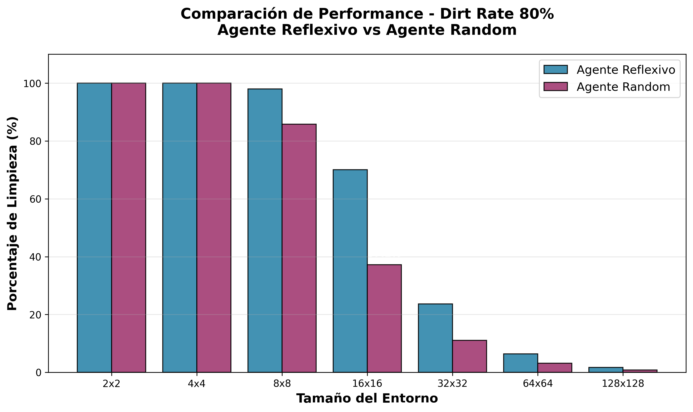
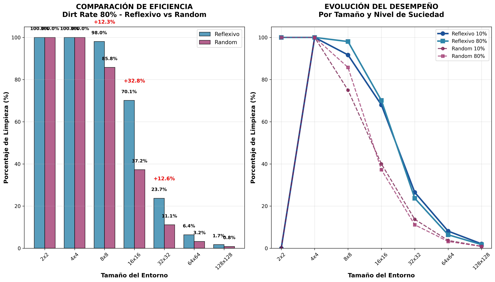
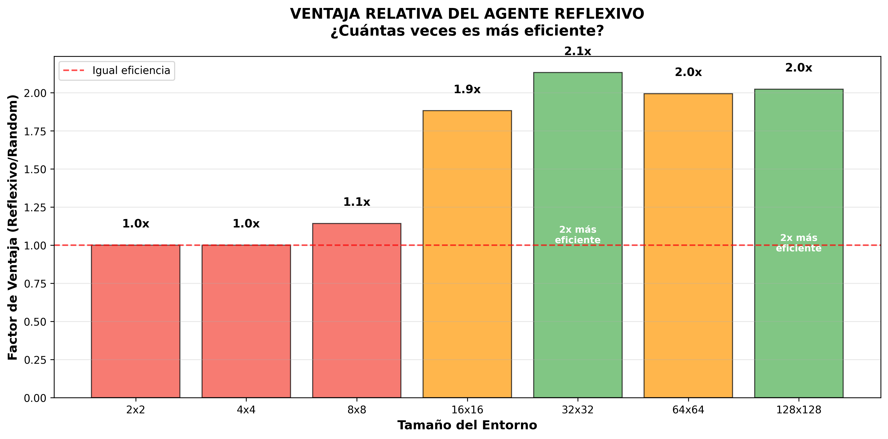

# Reporte TP2 Inteligencia Artificial

## Agentes Implementados

### Agente Reflexivo
Se desarrolló un agente reflexivo simple cuyos sensores permiten identificar si en la celda actual hay suciedad. Cuando detecta suciedad, el agente procede a limpiarla inmediatamente. Su patrón de movimiento es aleatorio: después de limpiar (o si no hay suciedad), se mueve aleatoriamente a cualquier celda adyacente (derecha, izquierda, abajo o arriba).

### Agente Random
Este agente toma todas sus decisiones de manera aleatoria. Cuando se encuentra en una celda con suciedad, tiene un 50% de probabilidad de limpiarla y un 50% de no hacer nada. Independientemente de su acción, siempre se moverá a una celda adyacente elegida aleatoriamente.

## Metodología de Evaluación

### Definición de Métricas
- **Performance:** Cantidad de celdas sucias limpiadas (máximo 1000 movimientos)
- **Porcentaje de Limpieza:** (Celdas limpiadas / Total celdas sucias) × 100
- **Límite:** 1000 movimientos por prueba

### Entornos de Prueba
- **Tamaños:** ["2x2", "4x4", "8x8", "16x16", "32x32", "64x64", "128x128"]
- **Niveles de suciedad (dirt_rate):** 10%, 20%, 40%, 80%
- **Pruebas por configuración:** 10 pruebas con distintas semillas
- **Total:** 7 tamaños × 4 dirt_rates × 10 seeds = 280 pruebas por agente

## Análisis de Resultados

### Eficiencia por Tamaño de Entorno (Dirt Rate Específico)

**Análisis cuantitativo para dirt_rate 80%:**
- **Tamaño 8x8:** Reflexivo: 98.0% vs Random: 85.8% (**+12.2% diferencia**)
- **Tamaño 16x16:** Reflexivo: 70.1% vs Random: 37.2% (**+32.9% diferencia**)
- **Tamaño 32x32:** Reflexivo: 23.7% vs Random: 11.1% (**+12.6% diferencia**)
- **Tamaño 128x128:** Reflexivo: 1.7% vs Random: 0.8% (**+0.9% diferencia**)

**Patrón identificado:** El agente reflexivo consistentemente logra aproximadamente **el doble del porcentaje de limpieza** que el agente random en entornos medianos y grandes.

### Evolución del Desempeño vs Complejidad del Entorno

**En entornos pequeños (2x2 - 8x8):**
- Ambos agentes logran >85% de limpieza
- Reflexivo alcanza 98-100% en la mayoría de casos
- Random muestra alta variabilidad (75-100%)

**En entornos grandes (64x64 - 128x128):**
- **Reflexivo:** 1.7-8.1% de limpieza
- **Random:** 0.8-3.7% de limpieza
- **Causa principal:** Límite de 1000 movimientos vs miles de celdas sucias

### Ventaja Relativa del Agente Reflexivo

**Factor de ventaja por tamaño:**
- **16x16:** 1.9x más eficiente
- **32x32:** 2.1x más eficiente  
- **64x64:** 2.0x más eficiente
- **128x128:** 2.0x más eficiente

## Análisis Comparativo Detallado

### Comportamiento en Diferentes Niveles de Suciedad

**Dirt Rate 10% (baja densidad):**
- Ambos agentes muestran mejor desempeño relativo
- Reflexivo mantiene ventaja consistente
- Movimientos alcanzan para mayor cobertura

**Dirt Rate 80% (alta densidad):**
- La ventaja del reflexivo se maximiza
- Ambos agentes enfrentan limitaciones severas
- El comportamiento deterministico del reflexivo brinda mayor ventaja

## Conclusión
 Podemos concluir que los 2 agentes en sí a medida que el entorno pasa a ser más complejo se vuelven bastante ineficientes, pero en cuando a su performance en ciertos entornos más medianos y chicos podemos decir que el agente reflexivo es mucho más efectivo por cuestiones de que a la hora de encontrarse una celda, este decide limpiarla, a diferencia de uno random.