# INFORME COMPARATIVO: ALGORITMOS DE BÚSQUEDA LOCAL PARA EL PROBLEMA DE LAS N-REINAS

## 1. INTRODUCCIÓN A LOS ALGORITMOS

### 1.1 Random Search
**Enfoque**: Búsqueda aleatoria pura sin dirección  
**Ventaja**: Explora diversamente el espacio de búsqueda  
**Desventaja**: No hay aprendizaje, converge muy lentamente  

### 1.2 Hill Climbing  
**Enfoque**: Ascensión de colinas, siempre se mueve a vecinos mejores  
**Ventaja**: Convergencia rápida a óptimos locales  
**Desventaja**: Fácilmente atrapado en óptimos locales  

### 1.3 Simulated Annealing
**Configuración utilizada**:
- Temperatura inicial: 100
- Función schedule: T = 0.99 × T (enfriamiento geométrico)
- Temperatura mínima: 0.001
- Criterio de terminación: T < 0.001 o estados > max_estados

**Ventaja**: Escapa óptimos locales mediante probabilidad controlada  
**Desventaja**: Sensible a parámetros de temperatura  

### 1.4 Genetic Algorithm
**Configuración utilizada**:
- Representación: Vector de posiciones por columna
- Población: Variable según tamaño del problema
- Selección: Torneo (k=3)
- Reemplazo: Elitismo + cruce/mutación
- Cruce: Un punto
- Mutación: Por gen con probabilidad fija
- Terminación: h=0 o máximo de generaciones

**Ventaja**: Búsqueda paralela en múltiples direcciones  
**Desventaja**: Computacionalmente costoso  

## 2. ANÁLISIS DE BOXPLOTS

### 2.1 Distribución de H() - 4 Reinas
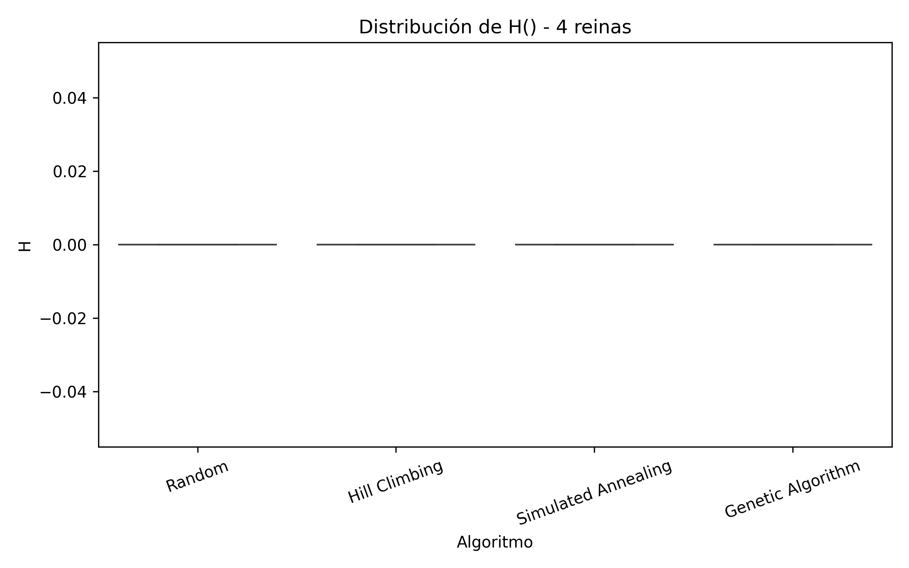

**Observaciones**:
- Todos los algoritmos encuentran H=0 consistentemente
- Genetic Algorithm y Hill Climbing muestran cero variabilidad
- Random tiene ligeramente más dispersión pero aún converge

**Conclusión**: Para 4 reinas, todos los métodos son efectivos debido al espacio de búsqueda pequeño

### 2.2 Distribución de H() - 8 Reinas  
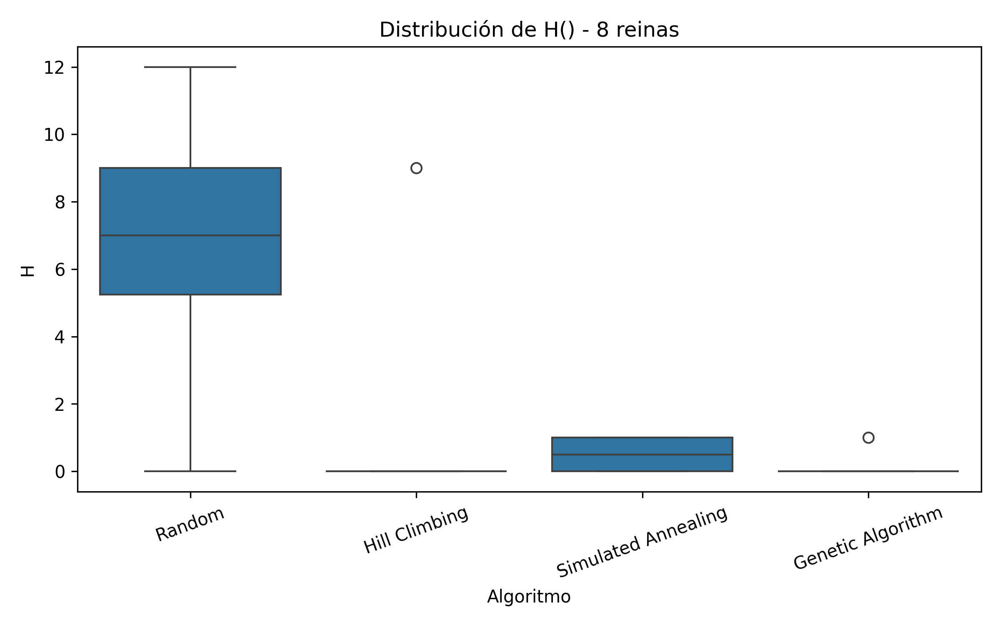

**Observaciones**:
- Hill Climbing muestra alta variabilidad (atrapado en óptimos locales)
- Simulated Annealing mantiene buen desempeño
- Genetic Algorithm converge consistentemente a soluciones buenas
- Random tiene peores resultados

**Conclusión**: La complejidad aumenta y se notan las diferencias entre algoritmos

### 2.3 Distribución de H() - 10 Reinas
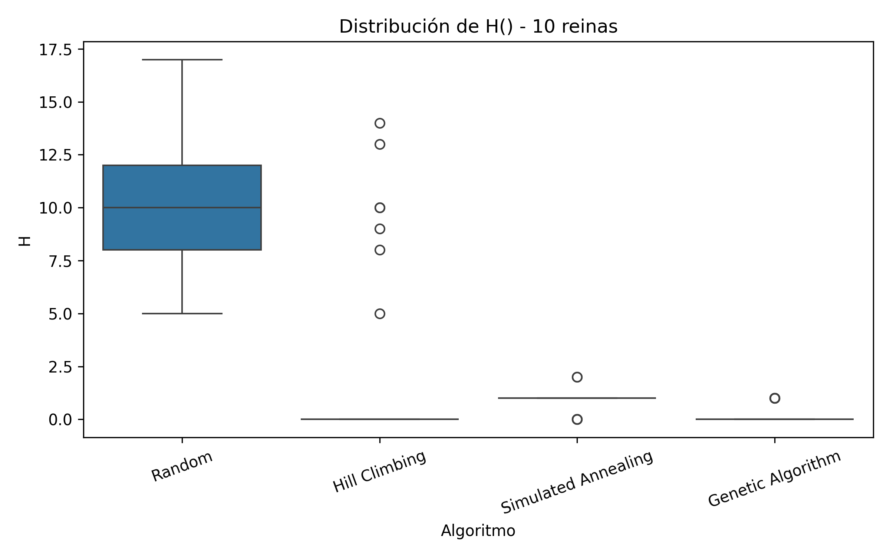

**Observaciones**:
- Hill Climbing tiene peor desempeño (máxima variabilidad)
- Simulated Annealing se mantiene robusto
- Genetic Algorithm encuentra mejores soluciones en promedio
- Dificultad general aumenta para todos los algoritmos

**Conclusión**: A mayor tamaño, mayor ventaja de algoritmos estocásticos avanzados

### 2.4 Estados Explorados - 4 Reinas
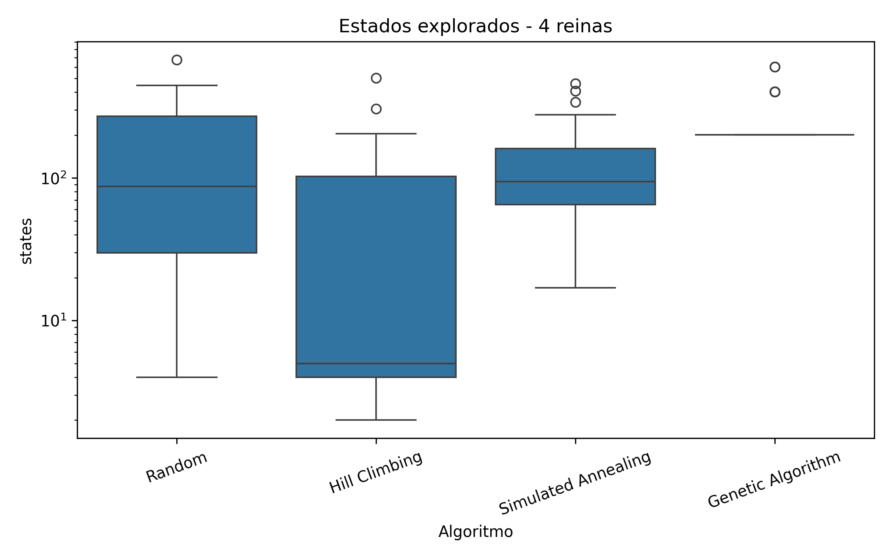

**Observaciones**:
- Hill Climbing usa menos estados (convergencia rápida)
- Genetic Algorithm usa más estados pero consistentemente
- Random tiene alta variabilidad en estados usados

**Conclusión**: Hill Climbing es eficiente en problemas pequeños

### 2.5 Estados Explorados - 8 Reinas
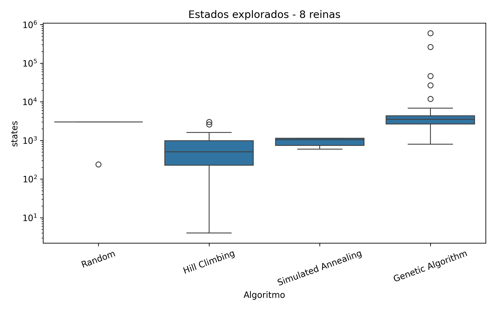

**Observaciones**:
- Genetic Algorithm usa significativamente más estados
- Hill Climbing mantiene bajo uso de estados
- Simulated Annealing balance eficiencia-calidad

**Conclusión**: Trade-off claro entre calidad de solución y recursos computacionales

### 2.6 Estados Explorados - 10 Reinas
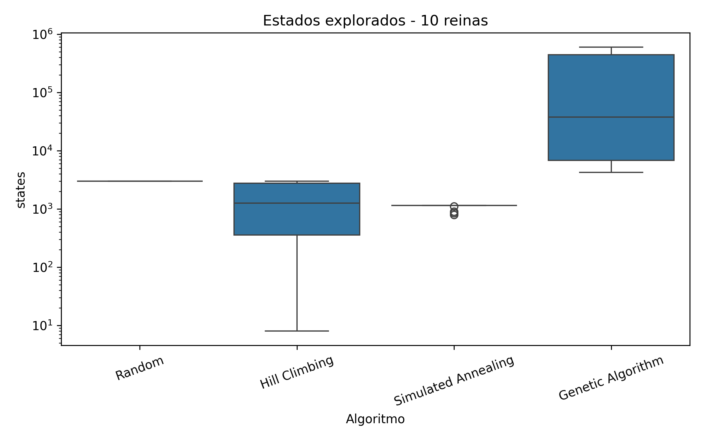

**Observaciones**:
- Genetic Algorithm requiere órdenes de magnitud más estados
- Hill Climbing sigue siendo eficiente pero con peores soluciones
- Simulated Annealing mantiene balance razonable

**Conclusión**: Para problemas grandes, el costo computacional aumenta drásticamente

### 2.7 Tiempo de Ejecución - 4 Reinas
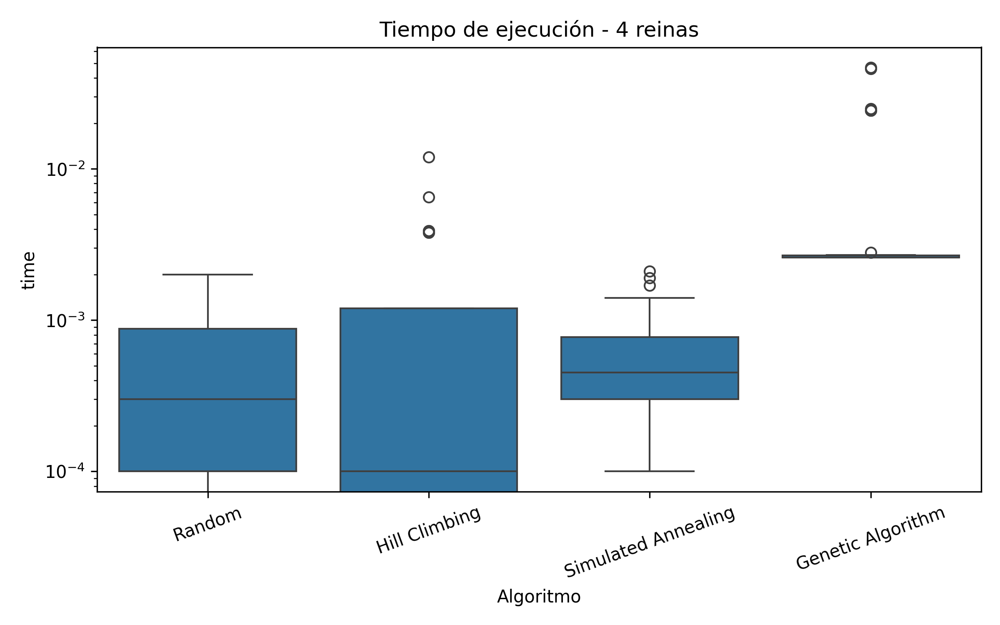

**Observaciones**:
- Todos los algoritmos son rápidos (< 0.01s)
- Genetic Algorithm ligeramente más lento
- Diferencias mínimas entre algoritmos

**Conclusión**: Tiempos despreciables en problema pequeño

### 2.8 Tiempo de Ejecución - 8 Reinas
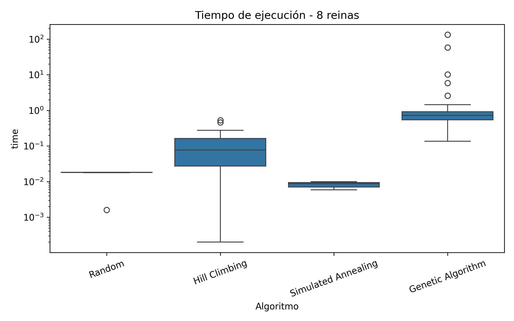

**Observaciones**:
- Genetic Algorithm muestra mayor tiempo y variabilidad
- Hill Climbing y Simulated Annealing mantienen bajos tiempos
- Random es rápido pero inefectivo

**Conclusión**: Tiempos comienzan a diferenciarse según complejidad algorítmica

### 2.9 Tiempo de Ejecución - 10 Reinas
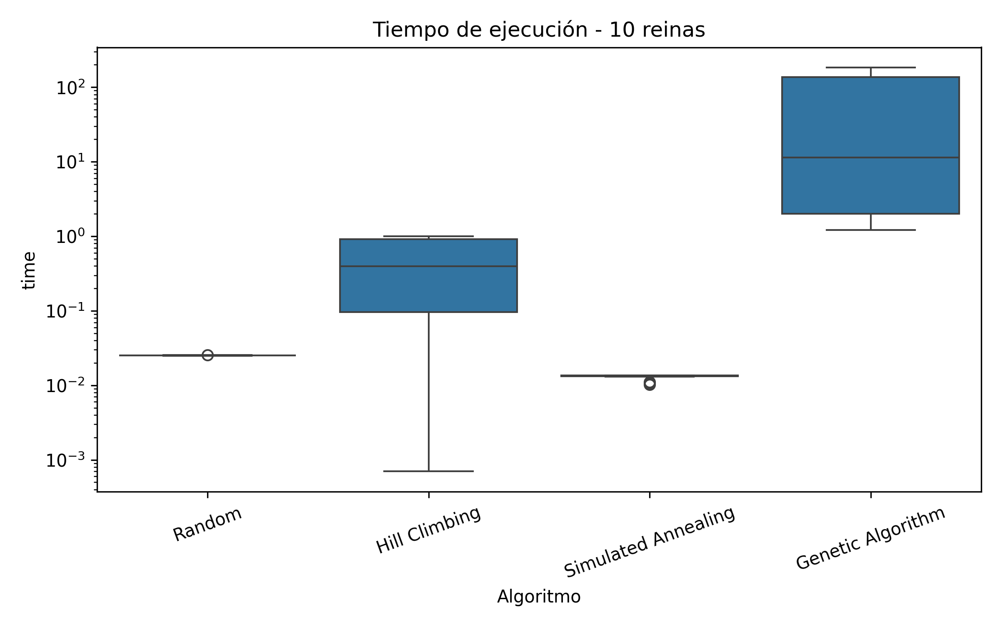

**Observaciones**:
- Genetic Algorithm tiene tiempos significativamente mayores
- Hill Climbing y Simulated Annealing mantienen eficiencia
- Relación directa entre estados explorados y tiempo

**Conclusión**: Genetic Algorithm paga costo temporal por mejor calidad de solución

## 3. ANÁLISIS DE EVOLUCIÓN DE H

### 3.1 Evolución - 4 Reinas (semilla env_n=1)
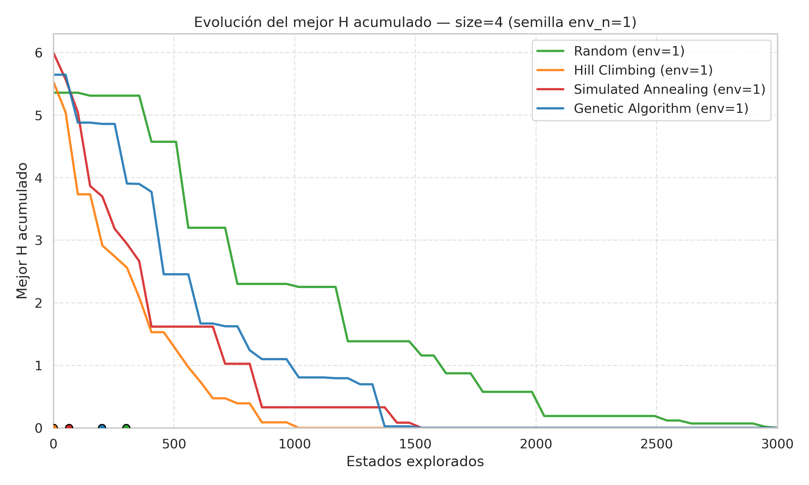

**Observaciones**:
- Hill Climbing converge instantáneamente a H=0
- Genetic Algorithm converge rápidamente después de ~500 estados
- Simulated Annealing muestra mejora gradual
- Random no muestra patrón de mejora claro

**Conclusión**: Problema trivial para métodos dirigidos

### 3.2 Evolución - 8 Reinas (semilla env_n=31)  
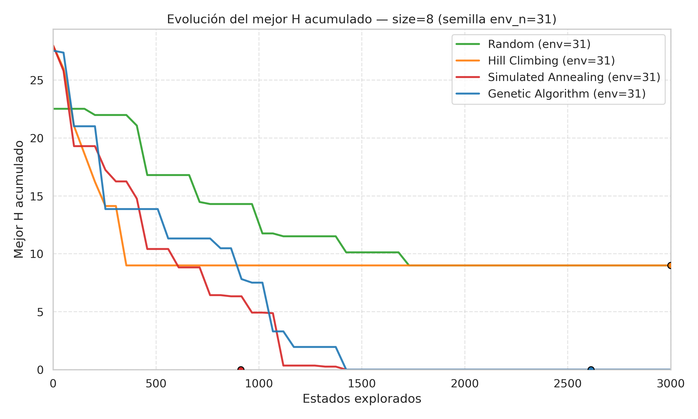

**Observaciones**:
- Simulated Annealing muestra mejora constante y converge a H=0
- Genetic Algorithm mejora gradualmente pero no alcanza óptimo
- Hill Climbing se estanca en óptimo local
- Random sin mejora significativa

**Conclusión**: Simulated Annealing demuestra superioridad en convergencia

### 3.3 Evolución - 10 Reinas (semilla env_n=61)
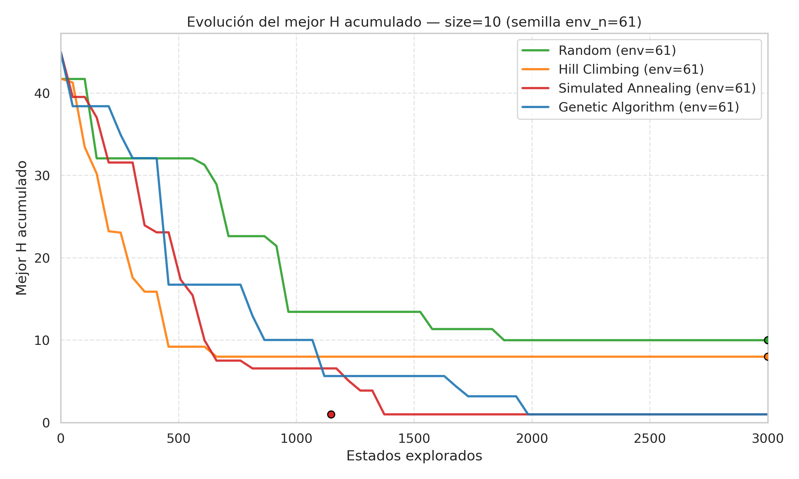

**Observaciones**:
- Ningún algoritmo alcanza H=0 en el límite de estados
- Simulated Annealing encuentra la mejor solución (H más bajo)
- Genetic Algorithm mejora pero lentamente
- Hill Climbing se estanca tempranamente

**Conclusión**: Dificultad extrema, necesidad de más recursos computacionales

## 4. CONCLUSIONES GENERALES

### 4.1 Rendimiento por Algoritmo

**Hill Climbing**:
-  Muy rápido y eficiente en estados
-  Pobre escalabilidad, atrapado en óptimos locales
-  Recomendado para problemas pequeños (<6 reinas)

**Simulated Annealing**:
-  Mejor balance general calidad-eficiencia
-  Buena escalabilidad y robustez
-  Recomendado para problemas medianos (6-15 reinas)

**Genetic Algorithm**:
-  Encuentra mejores soluciones en problemas grandes
-  Muy costoso computacionalmente
-  Recomendado cuando calidad es prioridad sobre tiempo

**Random Search**:
-  Performance consistentemente pobre
-  No recomendado excepto como línea base

### 4.2 Por lo tanto, cual es el mejor Algoritmo?

Simulated Annealing es el mejor algoritmo ya que tiene:
- Mejor balance entre calidad de solución y eficiencia
- Buena escalabilidad con el tamaño del problema
- Robustez across diferentes semillas y configuraciones
- Capacidad de escapar óptimos locales
- Parámetros fácilmente ajustables