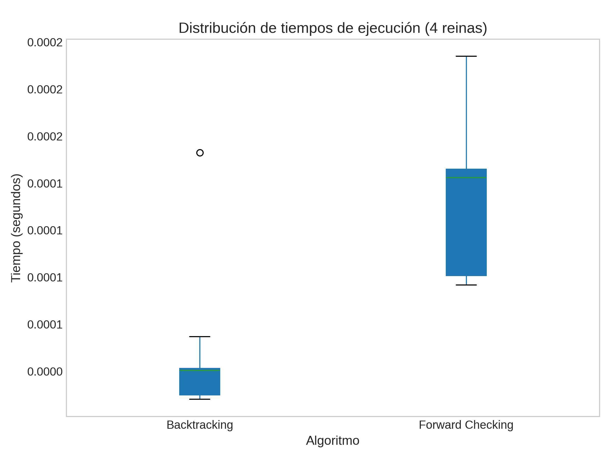
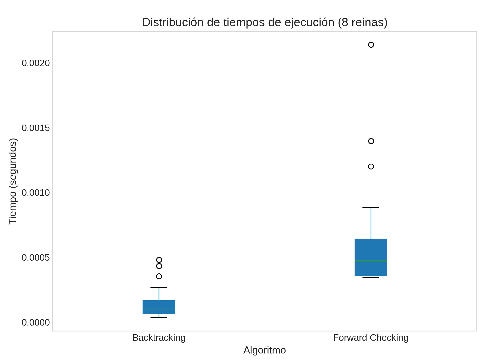
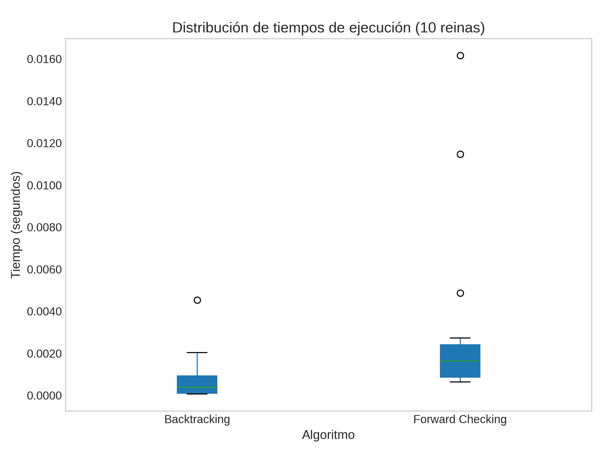
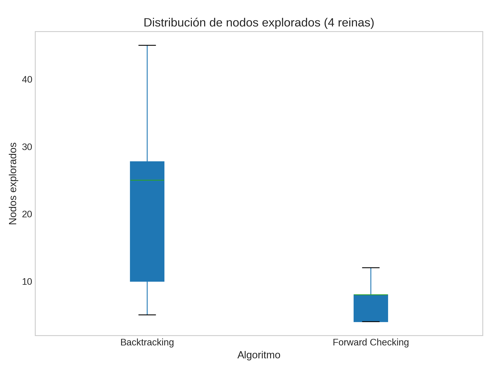
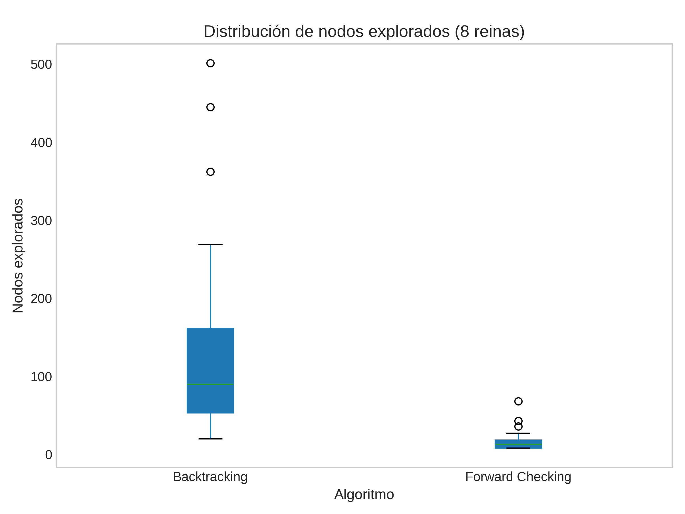
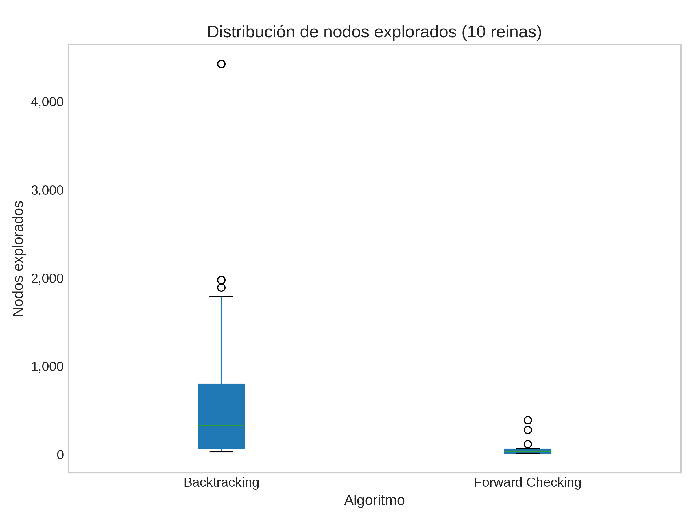

# Trabajo Práctico Número 5 : Satisfacción de Restricciones

## Ejercicio 1 : Formulación del Sudoku
El Sudoku puede formularse como un **problema de satisfacción de restricciones (CSP)**, donde se busca asignar valores a un conjunto de variables de manera que se cumplan ciertas restricciones.  
En el caso del Sudoku, el objetivo es llenar una cuadrícula de 9×9 con números del 1 al 9 cumpliendo las reglas del juego.

## 1. Variables
Cada casilla del tablero se modela como una variable, representada como X(r, c),  
donde *r* indica la fila (de 1 a 9) y *c* la columna (de 1 a 9).  

En total hay 81 variables.

## 2. Dominios
Cada variable X(r, c) puede tomar los valores del conjunto {1, 2, 3, 4, 5, 6, 7, 8, 9}.  
Si la casilla ya tiene un número dado por el enunciado, su dominio será solo ese valor.  

Por ejemplo:
- Si la casilla (1,1) contiene un 5, entonces Dom(X(1,1)) = {5}.
- Si la casilla (1,2) está vacía, entonces Dom(X(1,2)) = {1,2,3,4,5,6,7,8,9}.

## 3. Restricciones
El Sudoku tiene tres tipos de restricciones principales:

1. **Restricciones por fila:**  
   En cada fila, los valores asignados a las variables X(r,1) ... X(r,9) deben ser todos distintos.

2. **Restricciones por columna:**  
   En cada columna, los valores asignados a las variables X(1,c) ... X(9,c) deben ser todos distintos.

3. **Restricciones por bloque 3×3:**  
   En cada uno de los nueve bloques 3×3 del tablero, los valores deben ser todos distintos.

---

## Ejercicio 2 : AC-3 que detecta la incosistencia en el problema del mapa de Australia
## 1. Planteo inicial
Variables: WA, NT, SA, Q, NSW, V, T.  
Colores disponibles inicialmente: {red, green, blue}.

Asignación parcial dada:
- WA = red  → Dom(WA) = {red}
- V  = blue → Dom(V)  = {blue}

Dominios iniciales (antes de propagar):
- WA = {red}
- V  = {blue}
- NT = {red, green, blue}
- SA = {red, green, blue}
- Q  = {red, green, blue}
- NSW= {red, green, blue}
- T  = {red, green, blue}

Adyacencias relevantes:
- WA — NT, SA
- NT — WA, SA, Q
- SA — WA, NT, Q, NSW, V
- Q  — NT, SA, NSW
- NSW— Q, SA, V
- V  — SA, NSW
- T  — (ninguna conexión relevante para el coloreo)

Aplicamos el algoritmo AC-3 para hacer los arcos (X → Y) consistentes.

## 2. Proceso de propagación
1. **Revisar arcos hacia WA y V** (porque sus dominios son unitarios):
   - Arco (NT → WA): Dom(WA) = {red} ⇒ NT no puede ser red → **NT := {green, blue}**.
   - Arco (SA → WA): WA = red ⇒ SA no puede ser red → **SA := {green, blue}**.
   - Arco (NSW → V): V = blue ⇒ NSW no puede ser blue → **NSW := {red, green}**.
   - Arco (SA → V): V = blue ⇒ SA no puede ser blue → SA estaba {green, blue} → **SA := {green}** (queda unitario).

   **Dominios tras estas revisiones:**
   - WA = {red}
   - V  = {blue}
   - NT = {green, blue}
   - SA = {green}
   - Q  = {red, green, blue}
   - NSW= {red, green}
   - T  = {red, green, blue}

2. **Propagar el nuevo dominio unitario SA = {green}**:
   - Arco (NT → SA): SA = green ⇒ NT no puede ser green → NT estaba {green, blue} → **NT := {blue}**.
   - Arco (Q → SA): SA = green ⇒ Q no puede ser green → Q estaba {red, green, blue} → **Q := {red, blue}**.
   - Arco (NSW → SA): SA = green ⇒ NSW no puede ser green → NSW estaba {red, green} → **NSW := {red}**.
   - (WA no se ve afectada por SA=green porque WA≠green ya)

   **Dominios tras propagar SA={green}:**
   - WA = {red}
   - V  = {blue}
   - NT = {blue}
   - SA = {green}
   - Q  = {red, blue}
   - NSW= {red}
   - T  = {red, green, blue}

3. **Propagar NT = {blue}**:
   - Arco (Q → NT): NT = blue ⇒ Q no puede ser blue → Q estaba {red, blue} → **Q := {red}**.
   - (otros vecinos de NT ya consistentemente no contienen blue o no se ven afectados)

   **Dominios tras NT={blue}:**
   - WA = {red}
   - V  = {blue}
   - NT = {blue}
   - SA = {green}
   - Q  = {red}
   - NSW= {red}
   - T  = {red, green, blue}

4. **Propagar Q = {red}**:
   - Arco (NSW → Q): Q = red ⇒ NSW no puede ser red → NSW estaba {red} → **NSW := ∅** (vacío)

   Aquí obtenemos un dominio vacío para NSW. AC-3 detecta ese vacío y concluye que la asignación parcial es inconsistente (no existe extensión consistente de colores que respete todas las restricciones).

## 3. Conclusión
Al ejecutar AC-3 partiendo de los dominios iniciales con WA = red y V = blue, la propagación por arcos hace que sucesivamente:
- SA quede forzada a green,
- NT quede forzado a blue,
- Q quede forzado a red,
y finalmente NSW quede sin valores posibles (dominio vacío).

Por lo tanto, AC-3 detecta la **inconsistencia** de la asignación parcial **WA = red, V = blue** (porque produce un dominio vacío en NSW). Esto muestra que la arc-consistencia sola es capaz de descubrir que esa asignación parcial no puede extenderse a una solución completa.

---

## Ejercicio 3 : Complejidad en el peor caso de AC-3 en un CSP con grafo en forma de árbol

## Resumen rápido (respuesta)
Si ejecutamos el algoritmo AC-3 sobre un CSP binario cuyo grafo de restricciones es un **árbol** con \(n\) variables y cada dominio tiene a lo sumo \(d\) valores, la cota de peor caso para AC-3 es **O(n · d³)**.  
Existe un algoritmo especializado para árboles que resuelve el CSP en **O(n · d²)**, así que AC-3 no es la opción más eficiente si sabes de antemano que el grafo es un árbol.

## Derivación detallada

### 1) Notación y operaciones básicas
- n: número de variables (nodos del árbol).
- d: tamaño máximo del dominio de una variable.
- Número de aristas en un árbol: n-1 (sin ciclos).
- Número de arcos dirigidos que AC-3 maneja: como máximo 2*(n-1) = O(n).
- Operación clave: **Revise(X_i, X_j)** — para cada valor a en D_Xi buscamos al menos un valor b en D_Xj que cumpla la restricción binaria entre X_i y X_j.

### 2) Coste de una llamada a `Revise`
- Para cada valor a en D_Xi, se comparan hasta todos los valores b en D_Xj.  
- Con dominios de tamaño d, cada llamada a Revise cuesta **O(d^2)** operaciones.

### 3) Número de veces que se ejecuta `Revise` sobre un mismo arco
- Cada eliminación de un valor de dominio puede provocar que se re-examinen arcos vecinos.  
- Cada variable tiene a lo sumo d eliminaciones posibles.  
- Con n variables, hay O(n*d) posibles eliminaciones.  
- Por tanto, el número total de llamadas a Revise es O(e*d) = O(n*d) en un árbol.

### 4) Combinando costes
- Cada Revise cuesta O(d^2) y se hace O(n*d) veces → coste total: **O(n*d^3)**.

---

## Ejercicio 4 y 5 . Implementación del Algoritmo CSP para N-Queens y análisis de los resultados

### a) Backtracking
El algoritmo **Backtracking** explora recursivamente el espacio de soluciones, asignando valores a las variables (columnas del tablero) una por una.  
En cada paso:
1. Se selecciona una variable no asignada (columna actual).  
2. Se prueban los posibles valores del dominio (filas), verificando las restricciones.  
3. Si una asignación parcial viola alguna restricción, el algoritmo retrocede (“backtrack”) y prueba otra opción.  

Es un método **exhaustivo**, pero eficiente para problemas con fuertes restricciones.

### b) Forward Checking
El **Forward Checking** extiende el backtracking aplicando una forma parcial de inferencia.  
Cada vez que se realiza una asignación, se actualizan los dominios de las variables futuras eliminando los valores que serían inconsistentes.  
Esto reduce el espacio de búsqueda y evita explorar caminos imposibles desde etapas tempranas.  

En ambos algoritmos, el tablero se representó mediante un **array unidimensional** donde el índice indica la columna y el valor la fila correspondiente.  
Por ejemplo, para \( N = 4 \):  
`[2, 0, 3, 1]` representa las reinas ubicadas en las posiciones  
\((fila, columna) = (2,0), (0,1), (3,2), (1,3)\).

## 2. Entorno experimental

Los experimentos se realizaron sobre tres tamaños del problema:

| Tamaño (N) | Descripción |
|-------------|-------------|
| 4 | Tablero 4×4 |
| 8 | Tablero 8×8 |
| 10 | Tablero 10×10  |

Cada algoritmo se ejecutó **30 veces** utilizando **semillas distintas (0–29)** para garantizar diversidad en el orden de exploración de valores.

### Métricas registradas

Los datos recolectados para cada ejecución se guardaron en un archivo `resultados.csv` con las siguientes columnas:

| Columna | Descripción |
|----------|-------------|
| `Algoritmo` | Tipo de algoritmo usado (Backtracking / Forward Checking) |
| `Tamaño` | Valor de N |
| `Semilla` | Semilla aleatoria usada |
| `Éxito` | 1 si se encontró solución, 0 si no |
| `Tiempo` | Tiempo de ejecución en segundos |
| `Nodos` | Cantidad de nodos explorados |

Posteriormente, se generaron **boxplots** para analizar la distribución de los tiempos y de los nodos explorados.

## 3. Resultados: Tiempos de ejecución

A continuación se muestran los gráficos comparativos de tiempos de ejecución para los tres tamaños del problema:

**Distribución de tiempos por algoritmo**

### Análisis
Se observa que:
- Para \( N=4 \), ambos algoritmos resuelven el problema prácticamente al instante.  
- A medida que el tamaño del tablero crece, el **Backtracking puro muestra un incremento más pronunciado en tiempo**, mientras que el **Forward Checking** mantiene una distribución más compacta.  
- En las instancias de 10 reinas, la variabilidad del tiempo en Backtracking aumenta notoriamente, indicando que ciertas combinaciones de semilla pueden conducir a trayectorias de búsqueda mucho más costosas.

En conclusión, **Forward Checking ofrece una mejora clara en eficiencia temporal**, especialmente en problemas de mayor tamaño, al evitar ramas inconsistentes antes de explorarlas.

## 4. Resultados: Nodos explorados

**Distribución de nodos explorados por algoritmo**

### Análisis
- En tableros pequeños, ambos métodos exploran cantidades similares de nodos.  
- En instancias más grandes, **Forward Checking explora menos nodos en promedio**, evidenciando su capacidad para **podar el espacio de búsqueda** gracias a la reducción dinámica de dominios.  
- La dispersión de los valores (ancho del boxplot) muestra que el orden aleatorio de exploración influye en la eficiencia, aunque Forward Checking sigue siendo más estable.

## 5. Comparación con algoritmos de búsqueda local

A diferencia de los métodos sistemáticos como Backtracking y Forward Checking, los **algoritmos de búsqueda local** (por ejemplo, Hill Climbing, Simulated Annealing o Algoritmos Genéticos) no garantizan encontrar la solución, pero pueden hacerlo **mucho más rápido** en problemas de gran escala.

| Enfoque | Naturaleza | Ventajas | Desventajas |
|----------|-------------|-----------|--------------|
| **CSP (Backtracking / Forward Checking)** | Búsqueda sistemática | Encuentra soluciones exactas; completa; controlable | Escala mal con N grande; costo alto en nodos |
| **Hill Climbing / Simulated Annealing / Genéticos** | Búsqueda local | Rápidos; adecuados para tableros grandes | No garantizan solución; pueden atascarse en óptimos locales |

En resumen:
- Para tableros pequeños o medianos, los **CSP** son ideales por su precisión y transparencia.  
- Para tableros grandes (por ejemplo, \( N > 20 \)), los **algoritmos de búsqueda local** se vuelven más prácticos: sacrifican completitud a cambio de velocidad.  
- En la práctica, muchos solucionadores modernos combinan ambas estrategias (búsqueda sistemática con heurísticas estocásticas) para lograr un equilibrio entre **eficiencia y exactitud**.

