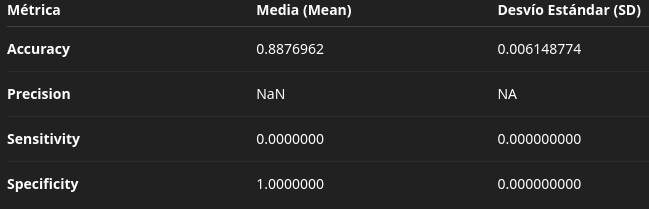

# Trabajo Práctico 7B - Validación Cruzada (Cross Validation)

## i) Código de las funciones `create_folds()` y `cross_validation()`

```r
# Función para crear folds
create_folds <- function(data, k) {
  set.seed(123)
  folds <- sample(rep(1:k, length.out = nrow(data)))
  return(folds)
}

# Función de validación cruzada
cross_validation <- function(data, k, classifier_func, ...) {
  folds <- create_folds(data, k)
  metrics <- data.frame(Accuracy = numeric(k),
                        Precision = numeric(k),
                        Recall = numeric(k),
                        Specificity = numeric(k))

  for (i in 1:k) {
    test_indices <- which(folds == i)
    test_data <- data[test_indices, ]
    train_data <- data[-test_indices, ]

    results <- classifier_func(train_data, test_data, ...)

    metrics[i, ] <- c(results$Accuracy,
                      results$Precision,
                      results$Recall,
                      results$Specificity)
  }

  metrics_summary <- data.frame(
    Metric = c("Accuracy", "Precision", "Recall", "Specificity"),
    Mean = colMeans(metrics),
    SD = apply(metrics, 2, sd)
  )

  return(metrics_summary)
}

```

## Resumen (media y desvío estándar)
 

