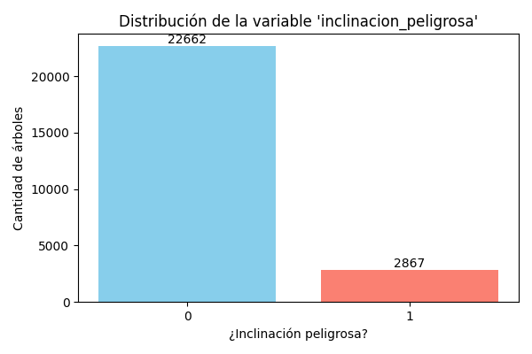
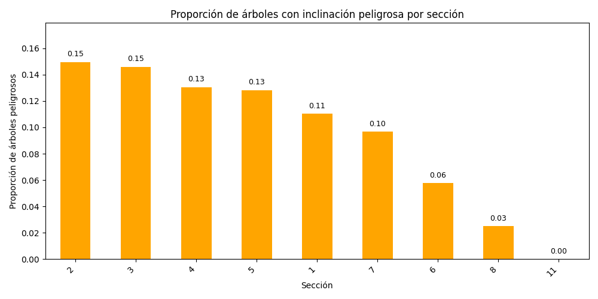
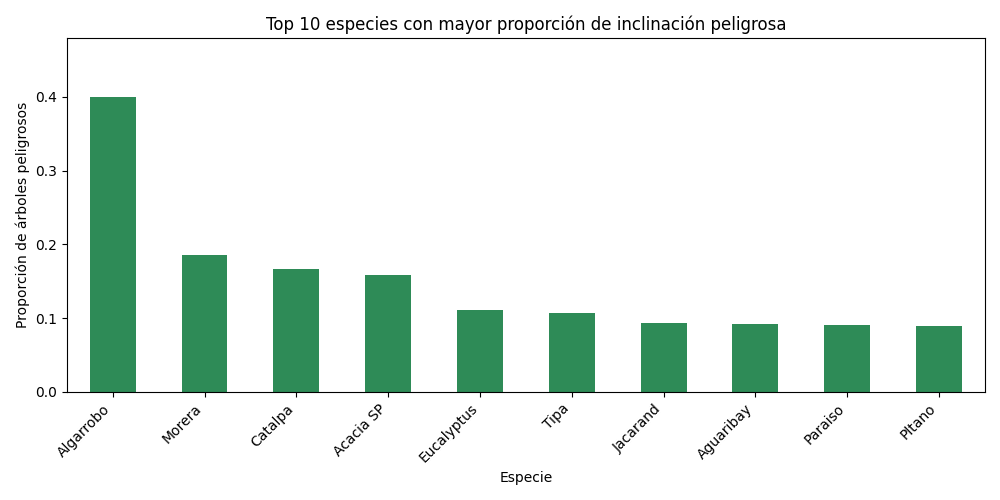
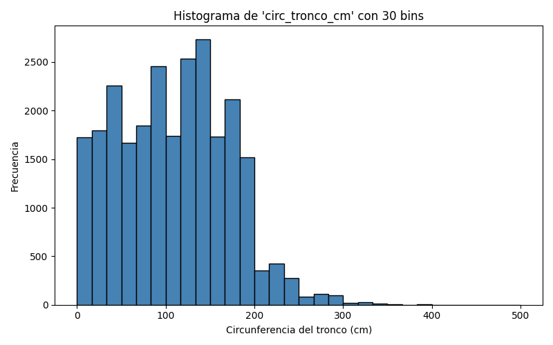
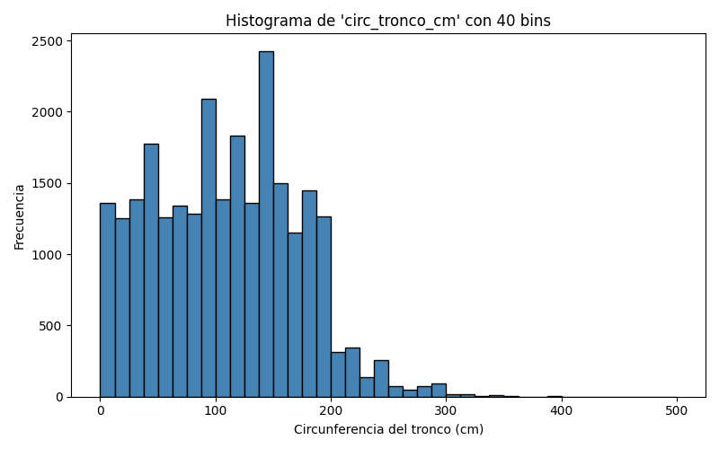
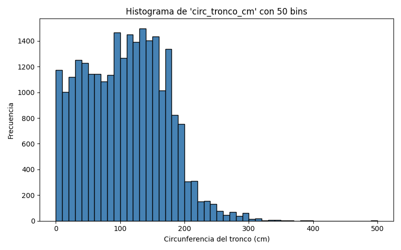
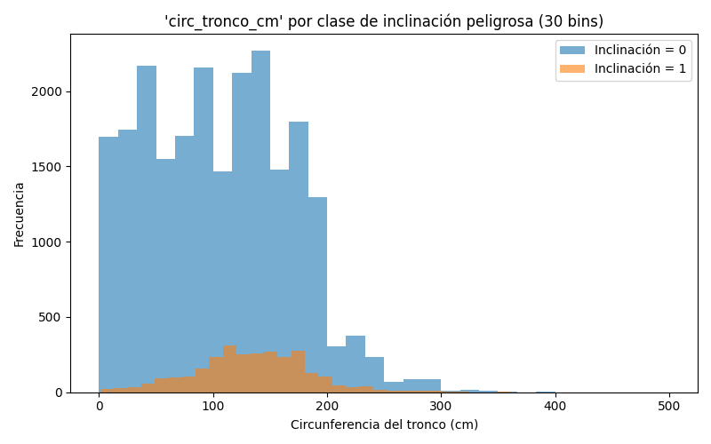
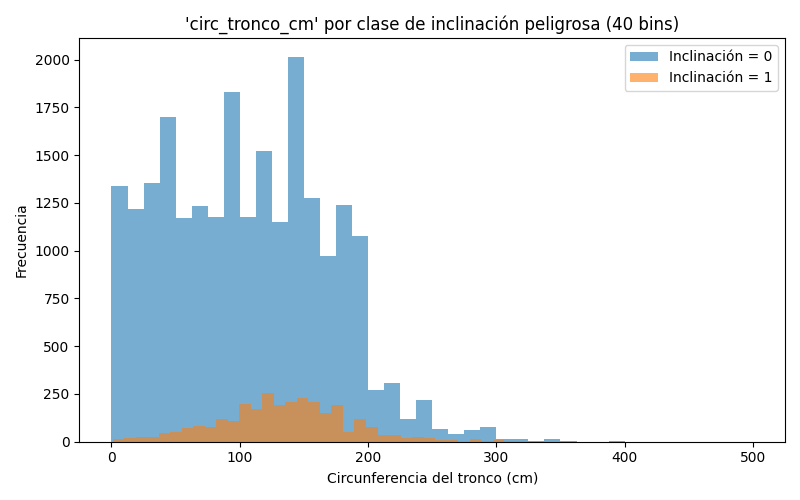
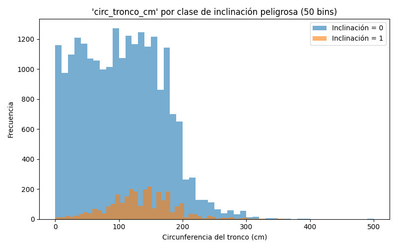

# Ejercicio 2 y 3

## Ejercicio 2

## a. ¿Cual es la distribución de las clase inclinacion_peligrosa?

**Justificación:** Este gráfico muestra la distribución general de la variable objetivo "inclinación_peligrosa" en el dataset de entrenamiento que abarca un 80% del dataset completo. Podemos observar que de un total de aproximadamente 25,529 árboles analizados, solo 2,867 presentan inclinación peligrosa, lo que representa aproximadamente el 11.2% del total.

## b. ¿Se puede considerar alguna sección más peligrosa que otra?

**Justificación:** Este gráfico analiza la distribución geográfica del riesgo, mostrando que ciertas secciones presentan proporciones significativamente mayores de árboles con inclinación peligrosa (hasta 15%).

## c. ¿Se puede considerar alguna especie más peligrosa que otra?

**Justificación:** Este análisis identifica las especies de árboles que presentan mayor riesgo de inclinación peligrosa. Las especies como **Algarrobo, Morera y Catálpa** aparecen como las de mayor proporción de riesgo.

---

## Ejercicio 3

## a. Histograma con 30,40 y 50 bins para la variable circ_tronco_cm

## b. Histograma con 30,40 y 50 bins para la variable circ_tronco_cm pero se separa por clase gracias al a variable inclinacin_peligrosa

## c. Creacion de una nueva variable categórica de nombre circ_tronco_cm_cat 

Para categorizar la variable, en este práctico se utilizaron cuartiles tal que los cortes quedaron asi:
- Bajo - Medio : 58.00cm
- Medio - Alto: 110.00cm
- Alto - Muy Alto : 156.00cm

